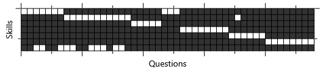
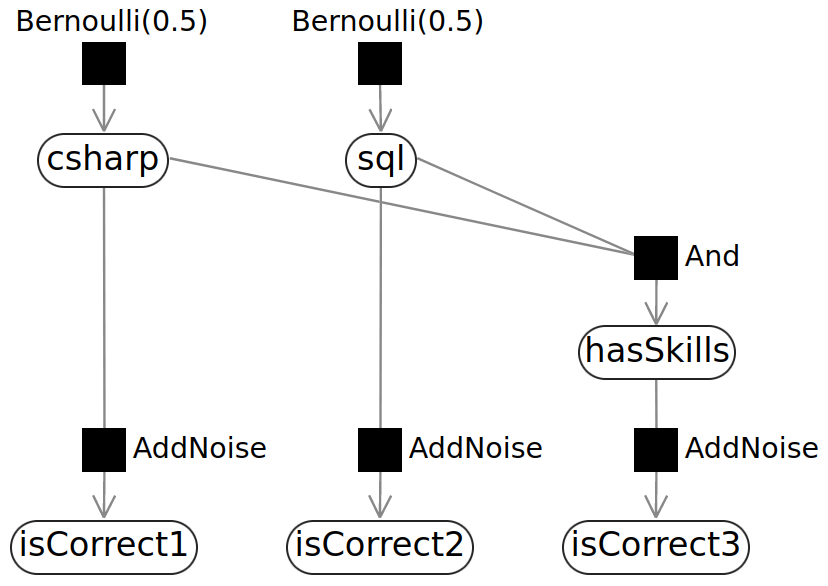
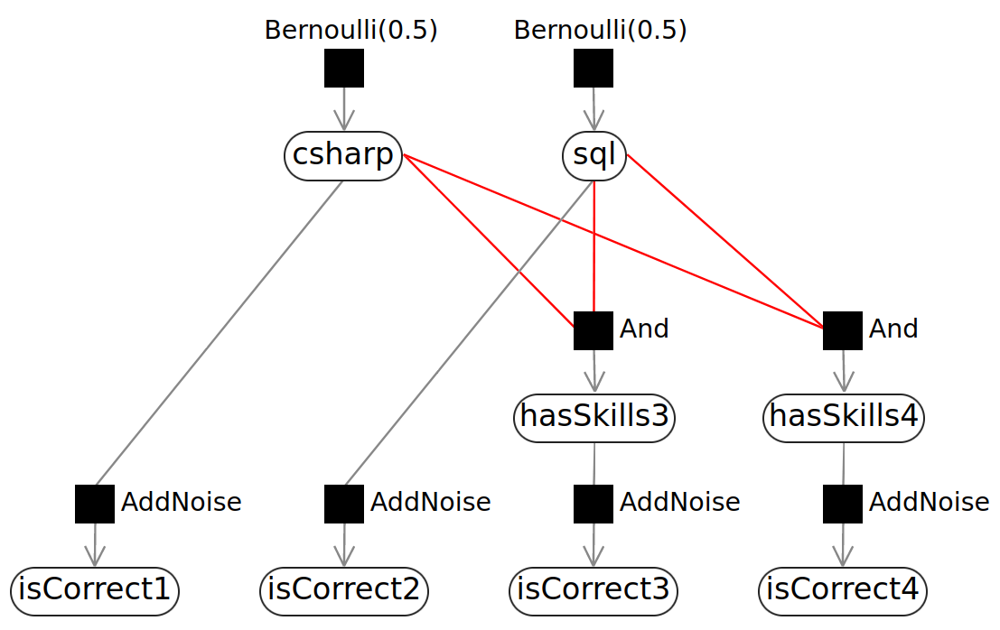
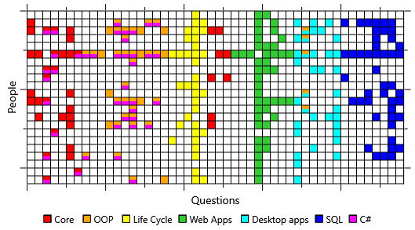
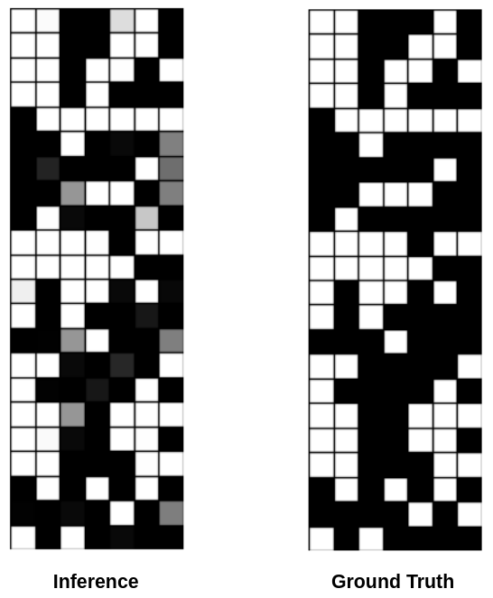
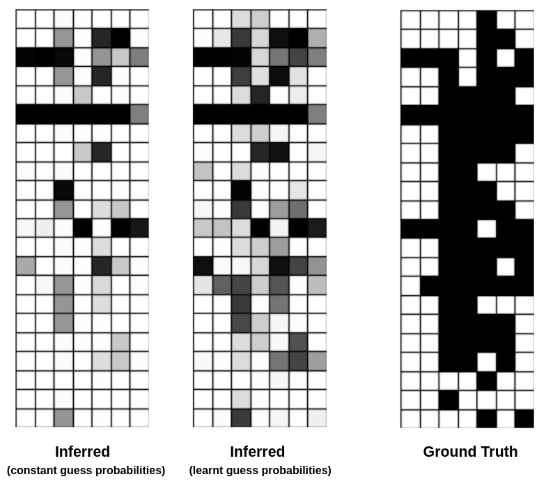

# Probabilistic Machine Learning Experiments with PyStan

Probabilistic modeling using PyStan with demonstrative case study experiments from Christopher Bishop's Model-based Machine Learning.

> **Note that** the the first run of all `*/infer.py` files will be slow since the PM model will be built and stored as `pickle` files. Subsequent runs will reuse this `pickle` file.

> **Be sure to** remove or relocate the corresponding `*.pkl` file(s) when changing model configurations. The older model will be used for inference, otherwise.

## Experiment: Mapping MCQ Test Responses to Candidate Skills

> An elaborate case study description can be found in [MBML Book, Chapter 2](https://www.mbmlbook.com/LearningSkills.html).

- Candidates take a multiple-choice test comprising 5 choices per question, with exactly one right answer per question.
- Each question is associated with a set of skills (one or more), that forms a part of the given dataset.
- **Goal**: Determine which skills each candidate has, and with what probability, given their answers in the test. 
- **Dataset**: Skill ground truth and response data for **22 candidates**, across **48 questions**, to assess **7 skills**, is contained in CSV files in the [data directory](./data).

The following binary heatmap represents the skills, one or more, assessed by each of the 48 questions in the dataset.   
   

The solution is implemented incrementally.   
A **probabilstic model** is formulated that makes the following **initial set of assumptions** on the data,

<ol type="A"><i>
<li>A candidate has either mastered each skill or not.</li>
<li>Before seeing any test results, it is equally likely that a candidate does or doesn’t have any particular skill.</li>
<li>If a candidate has all of the skills needed for a question, then they are likely to make a mistake once in ten times -- a 90% right answer probability.</li>
<li>If a candidate doesn’t have all the skills needed for a question, they will pick an answer at random. Hence, there’s a one in five chance that they get the question right -- a 20% right answer probability, assuming a uniform guessing distribution of course!</li>
<li>Whether the candidate gets a question right depends only on what skills that candidate has, and not on anything else.</li>
</i></ol>
   
_Assumptions C and D_ essentially give rise to a **model parameter** each, and they can be fine-tuned over time.

### Non-Vectorized Primitive Models

- The non-vectorized models are primitive implementations based on small subsets of data.
- They capture all possible candidate response combinations.
- They provide a way to intuitively ensure that the model is foundationally right, and that the assumptions and inference workflows are valid. 

#### Three-Question Model

- [Link to three-question model implementation](./03_three-question-model).
- Modeled for **2 skills** assessed through **3 questions**.
- These are **skills 1 and 7**; and **questions 1 through 3** on the skill-question heatmap. 
- Factors and evaluates skill probabilities for all possible response combinations.

The following **factor graph** represents the model and message flow for the three-question scenario. 
   

#### Four-Question Model

- [Link to four-question model implementation](./04_four-question-model).
- Modeled for **2 skills** assessed through **4 questions**.
- These are **skills 1 and 7**; and **questions 1 through 3** on the skill-question heatmap. 
- Factors and evaluates skill probabilities for all possible response combinations.

The following **factor graph** represents the model and message flow for the four-question scenario.  
   

### Baseline Vectorized Model

- [Link to baseline implementation on complete dataset](./05_vectorized-model).
- This is the first realisitic models that uses the complete dataset for inference.
- It carries the original model assumptions.
- The implementation used matrix operations for message passing and inference to manage larger datasets effectively, and to optimize for a GPU.

The following three-feature heatmap represents the correct and incorrect reponses of the 22 candidates to the 48 questions.    
      

   
- White blocks represent questions answered correctly, where colored boxes represent incorrect responses.
- The colors also mark each incorrect response with the skills required to answer them.
- The heatmap helps visually and qualitatively assess, which candidate likely lacks what skills.

The inferred skill probabilities are compared against the ground truth data on skills possessed by each of the 22 candidates in the grayscale heatmap below.   
   

### Diagnosing Issues: Ancestral Sampling to Generate Idealistic Sythetic Dataset

- [Link to baseline applied on **ancestrally sampled data**](./06_ancestral-sampling).
- Ancestral sampling uses the model assumptions of underlying probability distributions of the factors to sample a synthetic dataset.
- In essence, the synthetic dataset closely represents the model assumptions.
- Hence, the results may be used to evaluate the model assumptions and inference method.

The inferred skill probabilities based on sampled response data are compared against the ground truth data on skills possessed by each of the 22 candidates in the grayscale heatmap below.   
   

- The obtained results match the ground truth quite well, and much better than the baseline model.
- Since an idealistic dataset representing the model assumptions correctly gives rise to good inference, the inference methods and steps are valid and correct.
- The problem, in turn, lies with the model assumptions or the parameters therein; It does not represent the real dataset well.
- The next steps would involve sampling on select portions of the factor graph, freezing the rest, to identify which parameters/assumptions give rise to inaccuracies, and modifying them.

### Improved Vectorized Model: Learning Guess Probabilities

- [Link to improved implementation on complete dataset](./07_inferring-guess-probabilities).
- Selective ancestral sampling for analysis (*code not included*) suggests that guess probability values are not very realistic; Candidates are able to guess correct answers more often than once in ten attempts.
- To improve the probabilistic model, the guess probabilities are no longer assumed to be constant.
- Instead, the guess probability for each question is inferred through **message passing** and **belief propagation**  in the undirected factor graph.
- Specificially, assumption D is modified as follows.

<i><q>If a candidate doesn’t have all the skills needed for a question, they will pick an answer at random. **The probability of getting a question right, called the guess probability, is inferred from data**.</q></i> 

The inferred skill probabilities, when applying learnt guess probabilities, are compared against baseline performance and the ground truth data on skills possessed by each of the 22 candidates in the grayscale heatmap below.   
   

   
> Note that the ground truth is not used for this inference.    
> Rather, all possible combinations of 'skill sets' are generated and 'belief propagated' to infer the posterior for guess probabilities.

A substantial improvement in the inference is evident after learning the guess probabilities.      
Further improvements can be made, for instance, by learning the “**know probabilities**" and targetedly diagnosing other assumptions of the model.

## Other Experiments

## References

- [Model-Based Machine Learning *by John Winn*](https://www.mbmlbook.com/).
- [Lecture Material - 10-708: Probabilistic Graphical Models course, School of CS, Carnegie Mellon University *by Dr. Eric P. Xing*](https://www.cs.cmu.edu/~epxing/Class/10708-20/lectures.html).
- [Equivalent C# Infer.NET Implementation](https://github.com/dotnet/mbmlbook/tree/main).
- [PySTAN Documentation](https://pystan.readthedocs.io/en/latest/).
- [STAN Documentation](https://mc-stan.org/users/documentation/).
